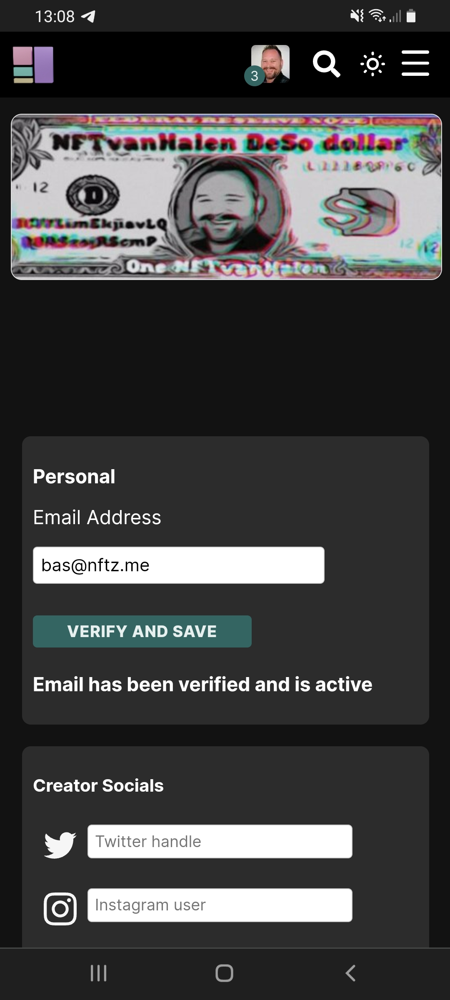

# How do I add my emailadres?

1. Make sure you are logged in.
2. Press on the '**=**' in top right corner.
3. Choose '**Manage'** and then '**Settings**'
4. At the top you can enter your email adress and press '**Verify and Save**'.

**Disclaimer:** We recommend using a gmail. Hotmail doesnt always come through. Remember to also check your spam if you have received emails.&#x20;

<figure><figcaption></figcaption></figure>
