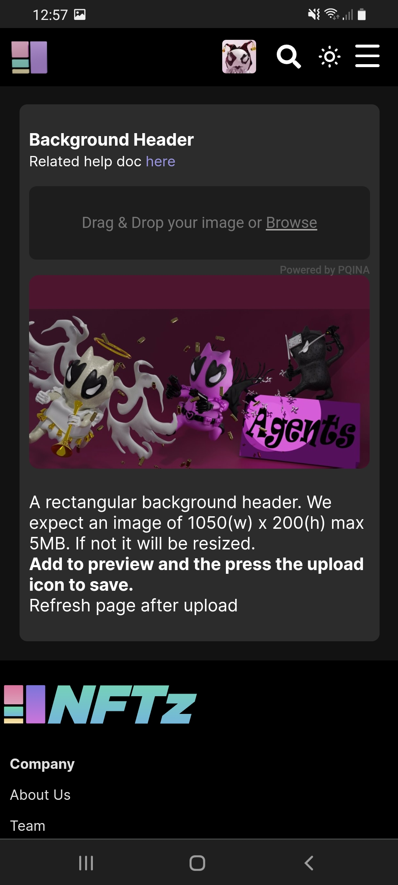

# How do you set an image banner at my personal page?

1. Make sure you are logged in.
2. Go to your personal page.
3. Press in the top-right screen **'='**.
4. Choose **'Settings'**.
5. Drag your image (jpg/png) to **Background Header**.
6. Press the **'upload symbol'** in the topright of the uploaded symbol.
7. Refresh the page.&#x20;



<figure><figcaption></figcaption></figure>
