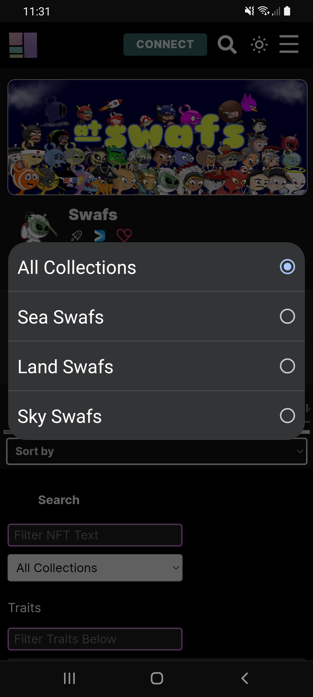

# How can I see a collection of an NFT artist?

1. Go to the zone (page) of the NFT artist. \[For example swafs.nftz.me]
2. Press the **'spy glass'**&#x20;
3. Click on **'All Collections**' and choose the collection \[For example Land Swafs]

**Disclaimer: Not all NFT projects have collections.**&#x20;

****



<figure><figcaption></figcaption></figure>
