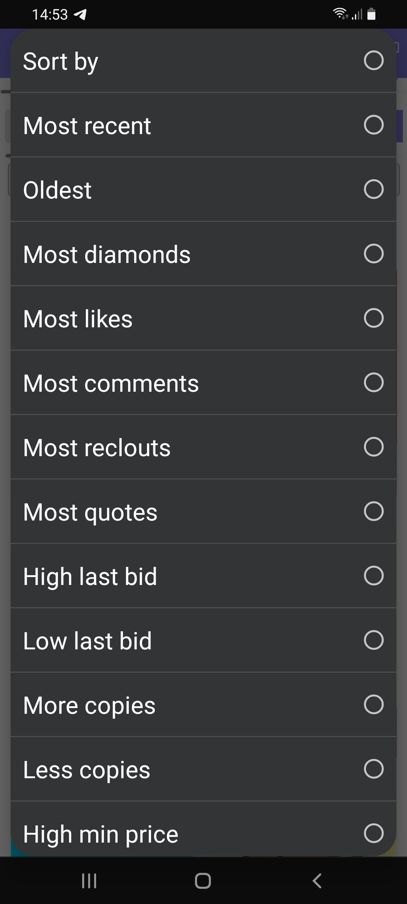

# How does the NFT market works for an buyer?

Understanding the NFT market will make it easier for you as a buyer to find the right purchase. The NFT marketplace almost feels like a shop but there are some differences. When an NFT creator mints an NFT and this is bought by another creator, multiple things can happen.&#x20;

**What happens after a NFT transaction:**

1. The owner can choose to not auction it and it will show listed as '**Not for sale**' on both the page of the creator of the NFT as the one who owns it. (remember you can always message the owner if you really want to buy it and make an offer;) &#x20;
2. The owner chooses to put the NFT on sale **without a buy now** **price**.  You will see a green button with '**Make Offer**'. Its possible to make a bid for the minimum amount asked or higher. Sometimes you will also see bids by other people. Only when the owner accepts a bid by closing the auction the NFT will have been sold. There is no time limit for how much time the auction can be open. Remember you can also message the owner for what amount he/she will sell it. You can always make a higher bid if you really want it.  &#x20;
3. The owner chooses to put the NFT on sale **with a buy now price.** You will see a green button called 'Buy NFT' By paying the full price of the Buy Now you will become the owner of the NFT right away. Depending on the owner sometimes there is also a lower mimum price for bidding set. This means its possible to make a lower bid than the buy now price.  For example an NFT has a minimum price of 1 deso and a buy now price of 2 deso. If you bid the minimum price or higher than the owner can choose to accept this bid. Remember that you can be outbidded or even doing a buy now. Also it's possible that the owner does not want to sell the NFT and closes the auction without any buyers. If the 'minimum bid price' and the 'buy now price' are the same, always choose the 'Buy Now' price as this will automatically close the auction and make you the owner of the NFT.

Two other options not related with buying

4\. The owner chooses to transfer the NFT to another creator. This happens sometimes if creators trade NFTs with each other or want to gift somebody.

5\. The owner chooses to burn the NFT. If this happens the NFT is removed from the blockchain and will be shown as a post instead of an NFT.&#x20;

At NFTz we have created many different ways to sort the NFTs an artist have. This makes it easier for the buyer to find the right NFT. At the next page you can see what are good ways to sort the NFTs for a purchase.&#x20;

