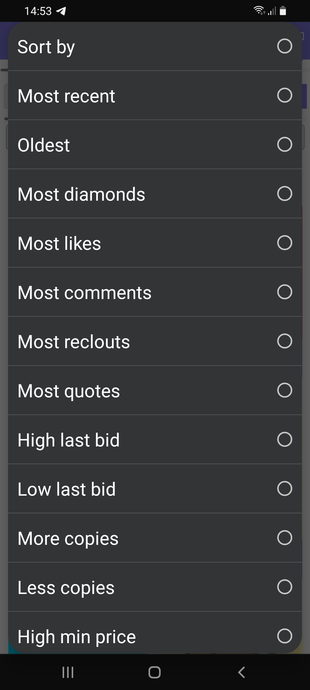

# How does the NFTz market work for a buyer?

Understanding the NFTz market will make it easier for you, as a buyer, to find the purchase that is right for you. The NFTz marketplace almost feels like a shop but there are some differences. When an NFT creator mints an NFT and it is purchased by another creator, multiple things can happen.&#x20;

**What happens after an NFT transaction:**

1. The owner can choose to just hold onto it, and '**Not for sale**' will be displayed on both the creator's zone (page) as well as on the new owner's zone (page); remember you can always message the owner if you really want to buy it and make an offer) &#x20;
2. The new owner chooses to put the NFT on sale **without a buy now** **price**.  You will see a green button with '**Make Offer**'. In this case, it's possible to make a bid (offer) for the minimum amount asked or higher. Sometimes you will also see bids by other people. Only when the owner accepts a bid by closing the auction, the NFT will have been sold. There is no time limit for how much time the auction can be open. Remember you can also message the owner for what amount he/she will sell it. You can always make a higher bid if you really want it.  &#x20;
3. The owner chooses to put the NFT on sale **with a buy now price.** You will see a green button called 'Buy NFT'. By paying the full price of the Buy Now, you will become the new owner of the NFT right away. Depending on the current owner, sometimes there is also a lower minimum price for bidding set. This means it's possible to make a lower bid than the current 'buy now' price.  For example, an NFT has a minimum price of 1 deso and a buy now price of 2 deso. If you bid the minimum price or higher, then the current owner can choose to accept this bid. Remember that you can still be outbid or even have someone else 'buy it now' before your offer is accepted. Also it's possible that the owner does not want to sell the NFT and closes the auction without any buyers. If the 'minimum bid price' and the 'buy now price' are the same, always choose the 'Buy Now' price as this will automatically close the auction and make you the owner of the NFT.

Two other options not related with buying

4\. The owner chooses to transfer the NFT to another creator. This happens sometimes if creators trade NFTs with each other or want to gift somebody.

5\. The owner chooses to burn the NFT. If this happens the NFT is removed from the blockchain and will be shown as a post instead of an NFT.&#x20;

At NFTz we have created many different ways to sort the NFTs an artist has. This makes it easier for the buyer to find the right NFT. Keep reading to see what some good ways to sort NFTs for a purchase can be.

