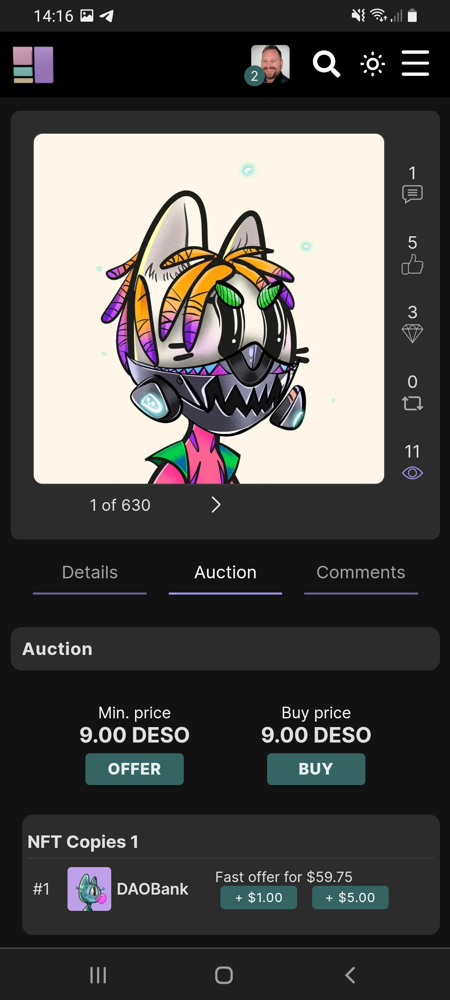
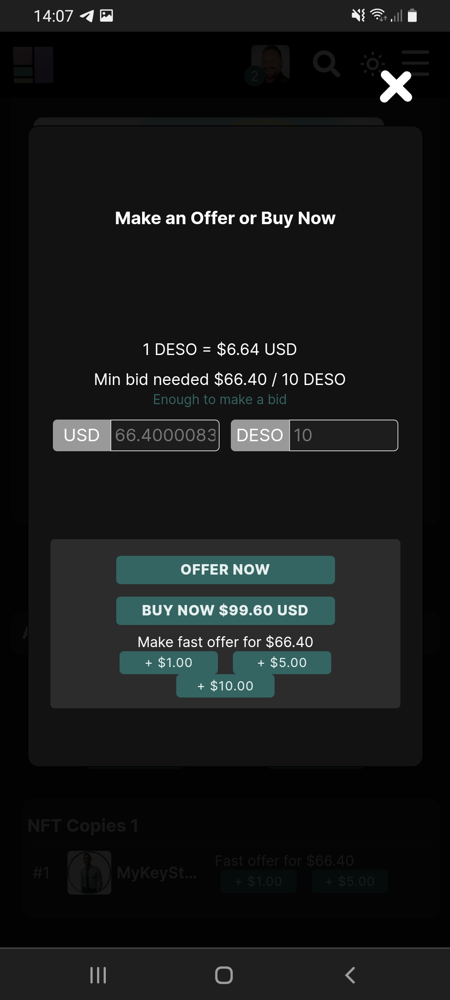

# How to buy an NFT?

<mark style="color:green;">Some NFT's have a 'Buy Now' button. Buying a NFT is as easy as just pressing that button. You don't have to take extra steps.</mark>&#x20;

<mark style="color:green;"></mark>

#### How to buy an NFT? \[Fast Bid]

1. Make sure you are logged in.
2. Go to the corresponding NFT.
3. You can make three different kinds of a 'Fast Bid' of **$1** or **$5** or **** above the current minimum or high bid.  \[It's really handy if you need to be fast!] &#x20;

**How to buy an NFT? \[Buy Now]**

1. Make sure you are logged in.
2. Go to the the corresponding NFT.&#x20;
3. Press the '**Buy'** Button.&#x20;
4. Press accept again.&#x20;

#### How to buy an NFT? \[Custom]

1\. Make sure you are logged in.

2\. Go to the corresponding NFT.

Press the green '**Offer**'  Button.

3\. Choose the 'Serial Number' you want to have. (Only necessarily if there are multiple Serials of the same NFT also known as bulk minting)

4\. Fill in 'DESO'. If you put in DESO you can also see the offer in USD you are going to make.&#x20;

5\. Press the green '**Offer Now**' Button. __&#x20;

__

**Disclaimer: It is important that an NFT is unique and not a copy of someone else's work to avoid copyright infringement. Be careful with buying NFTs from new creators, its possible that you are buying a copy of another artist. Make sure you do your own research.**

<figure><figcaption></figcaption></figure>

<figure><figcaption></figcaption></figure>
