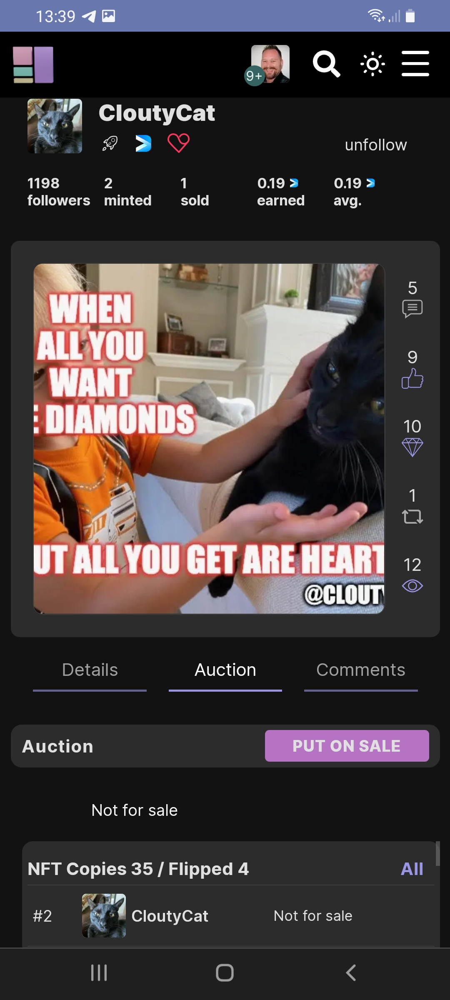

# How to claim a free NFT?

At NFTz it's possible to claim free NFTs.&#x20;

**Claim an NFT:**

1. Make sure you are logged in.
2. Go to the corresponding NFT.
3. Click <mark style="color:purple;">'Claim NFT' on any claimable NFT.</mark>&#x20;
4. Follow the claim requirements. This could include:

* Like this NFT >>> 'Click the **thumbs up icon**'.
* Diamond this NFT >>> 'Click **the diamond icon**'
* Follow this creator >>> 'Click on **follow** next to the user name'

5\. If required, click '<mark style="color:purple;">Claim NFT</mark>' once again if there were claim requirements.

**It doesnt work:**

If you keep getting errors you can go to our [troubleshoot](../../troubleshoot/troubleshoot.md) or contact us at our [telegram](https://t.me/+qdNeX8CYB\_swZTQx) or [Discord](https://discord.gg/jQ34WMMZce).&#x20;



<figure><figcaption></figcaption></figure>

&#x20;

