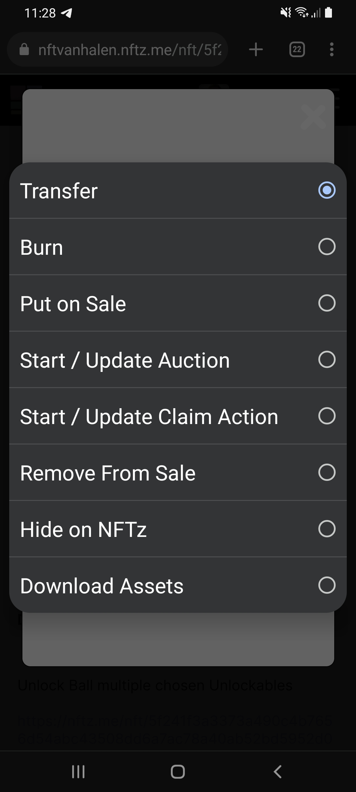
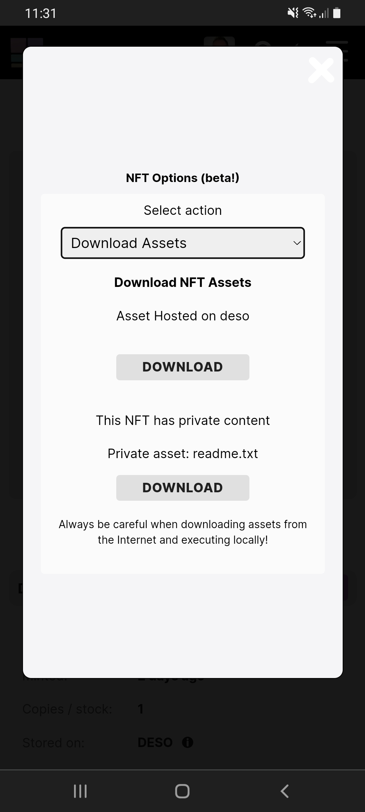

# How to see unlockable content?

If you have received an NFT with unlockable content you can see this content by following the steps below. Only the owner of the NFT can open the unlockable content. Text messages will be shown as a readme.txt file.&#x20;

## How to see unlockable content?

1. &#x20;[Log in](../../users-guide/welcome/how-do-you-login-to-nftz.me.md) on your username.nftz.me&#x20;
2. Go to the corresponding NFT.
3. Press on '<mark style="color:purple;">**\~Options**</mark>' (If using a mobile phone press 'Details' first)
4. Press Transfer and go to '**Download Assets**'
5. Press '**Download**' under Private Assets.

**Disclaimer: Always be vigilant for malicious content. Open files at your own risk.**&#x20;

****

**If it** **doesn't work:** Please go to our [troubleshoot](https://app.gitbook.com/o/hhkiTE1cLAJkwKs4XguV/s/1uei8FM8t4nPzvokagIX/troubleshoot/troubleshoot) page or contact us on our [telegram](https://t.me/+qdNeX8CYB\_swZTQx) or [Discord](https://discord.gg/jQ34WMMZce).

<figure><figcaption></figcaption></figure>

<figure><figcaption></figcaption></figure>
