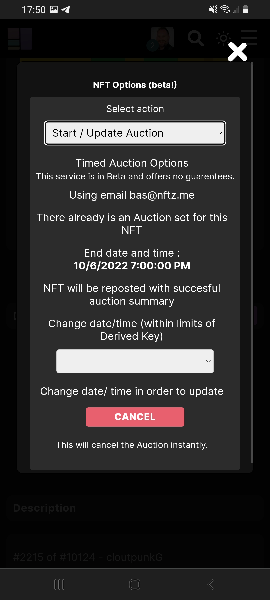

# How do you cancel a timed auction?

When a [timed auction](how-do-you-make-a-timed-auction.md) is going on it's always possible to cancel the timed auction. After the timed auction has been cancelled the NFT auction will stay open to receive bids. To clarify the cancel option will only remove the timer of the NFT auction. It's also possible to [update](how-do-you-update-a-timed-auction.md) the NFT auction with another date or time right away.&#x20;

**Cancel a timed auction**

1. Make sure you are logged in.
2. Go to the NFT and click on the  \~<mark style="color:purple;">Options</mark> button. If you have a mobile phone its behind the tab '**Details**'.&#x20;
3. Choose the option '**Start / update auction**'
4. Press the button '<mark style="color:red;">Cancel</mark>'.

You will receive a mail that the auction has been cancelled.

If you questions or are getting errors you can go to our [troubleshoot](../../troubleshoot/troubleshoot.md) or contact us at our [telegram](https://t.me/+qdNeX8CYB\_swZTQx) or [Discord](https://discord.gg/jQ34WMMZce).&#x20;

<figure><figcaption></figcaption></figure>
