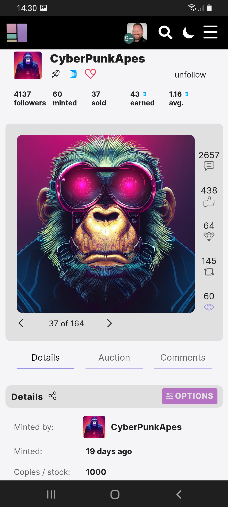
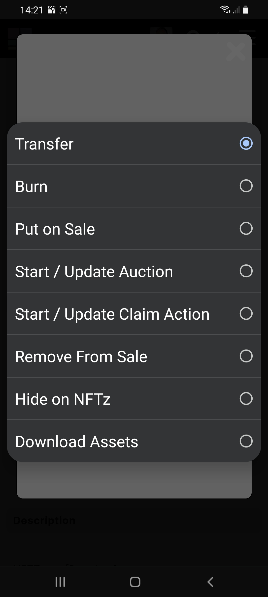
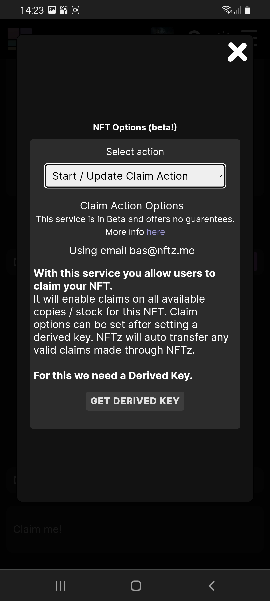
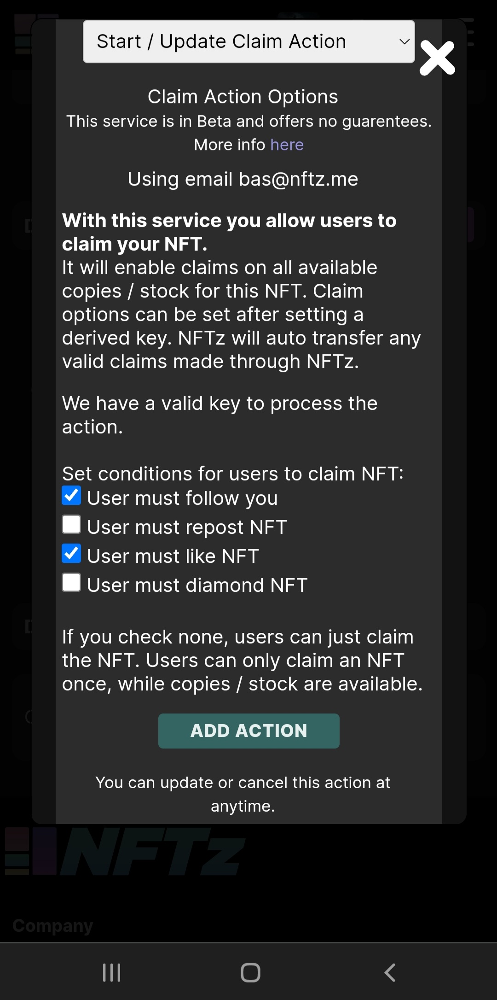
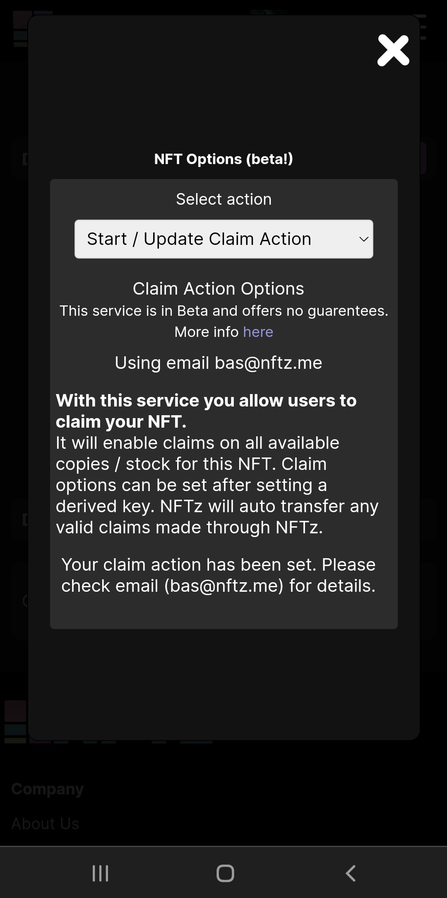

# How do you create a claimable free NFT?

At NFTz it's possible to create a claimable free NFT that will automatically go to the user if they fulfill the set requirements. This saves the creator a lot of time in not having to transfer the NFTs manually if giving away a large number of NFTs. If you are interested in transferring an NFT manually to another user, click on [transfer](how-to-transfer-an-nft.md).&#x20;

**Create a claimable NFT:**&#x20;

1. Make sure you are logged in.
2. Go to the corresponding NFT or [mint](how-do-you-mint-sell-an-nft.md) a new NFT: The NFT must have **multiple serials** and **not be on sale at the time**.
3. Click on <mark style="color:purple;">\~Options</mark>. (on a mobile device go to '**Details**' first)
4. Choose '**Start / Update Claim Action**'. (Set an email address if you haven't set one yet and verify it).
5. Press '**get derived key**'
6. Choose '**Approve**'
7. Set the preferred conditions for users to claim NFT:

* User must follow you
* User must repost NFT
* User must like NFT
* User must diamond NFT

You can also choose to leave them all off.

8\. Press '**Add Action**'.

**If this doesn't work:**

Remember your NFT must have multiple serials (more than one copy) or else you will get the following message 'Claim action is only available for NFTs with at least 1 copy / stock / serial and you must be the creator.'  When you [mint](how-do-you-mint-sell-an-nft.md) an NFT remember to set multiple copies beneath the **'more options (advanced and collection**) menu'. If you have minted an NFT with multiple serials you can create a claimable NFT.&#x20;

If you continue receiving errors you can go to our [troubleshoot](../../troubleshoot/troubleshoot.md) or contact us at our [telegram](https://t.me/+qdNeX8CYB\_swZTQx) or [Discord](https://discord.gg/jQ34WMMZce).&#x20;

<figure><figcaption>
Choose Options
</figcaption></figure>

<figure><figcaption>
Choose Start / Update Claim Action
</figcaption></figure>

<figure><figcaption>
Get Derived Key
</figcaption></figure>

<figure><figcaption>
Choose conditions and press Add Action
</figcaption></figure>

<figure><figcaption></figcaption></figure>
