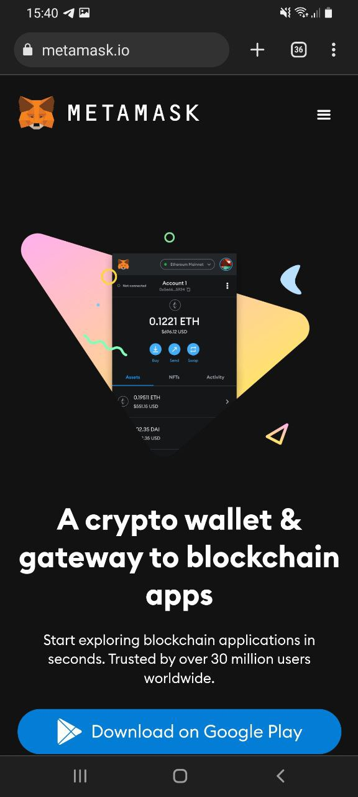

# How do you make  a metamask wallet? \[Android]

For buying and selling NFTs on Ethereum you will need a metamask wallet. This page will show you how to set up your metamask wallet. For the use of Deso NFTs you won't need a metamask wallet. We advise using google chrome as browser for the most optimised user experience. When using Ethereum features on NFTz you will get an automatically popup of the metamask app. **Features are currently in Beta and might not yet work.**

**Making a metamask Wallet:**

1. Go to [https://metamask.io/](https://metamask.io/)
2. Press the blue button '**Download on Google Play**'.
3. Install the app. (This extension will be used by NFTz for signature requests)
4. Set up your metamask wallet. Remember to keep your password safe and private.&#x20;

**It doesnt work:**

If you keep getting errors you can go to our [troubleshoot](../../troubleshoot/troubleshoot.md) or contact us at our [telegram](https://t.me/+qdNeX8CYB\_swZTQx) or [Discord](https://discord.gg/jQ34WMMZce). Also for issues related to the metamask wallet you can go to the [official help page](https://support.metamask.io/hc/en-us)[.](https://support.metamask.io/hc/en-us)

<figure><figcaption></figcaption></figure>
