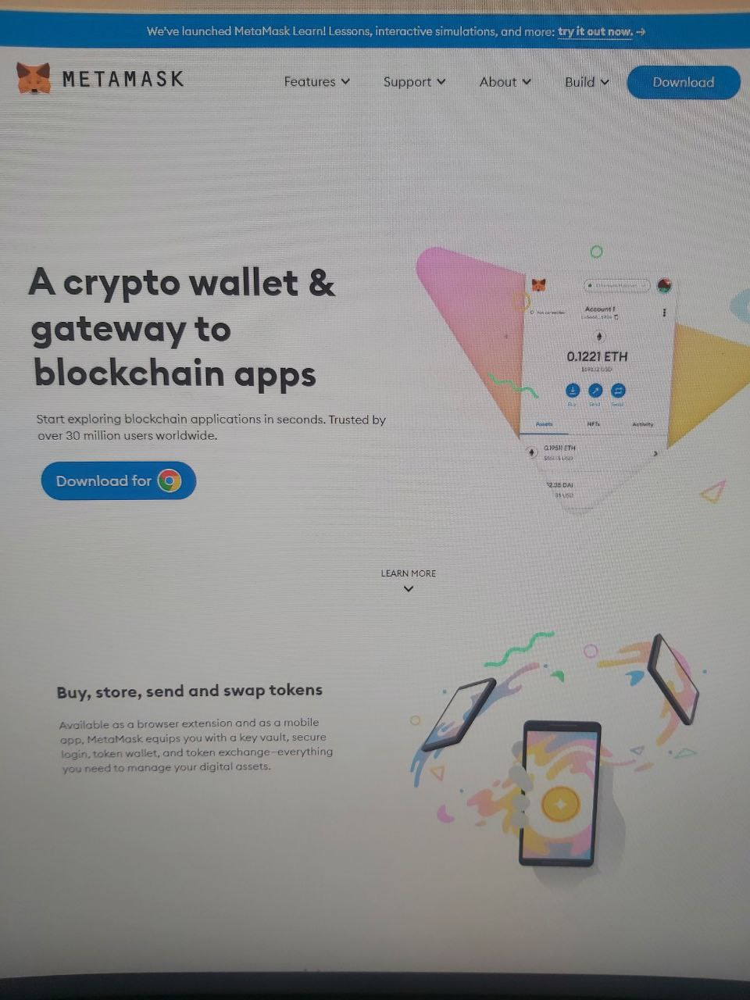

# How do you make  a metamask wallet? \[PC]

For buying and selling NFTs on Ethereum you will need a metamask wallet. This page will show you how to set up your metamask wallet. For the use of Deso NFTs you won't need a metamask wallet. We advise using google chrome as browser for the most optimised user experience. When using Ethereum features on NFTz you will get an automatically popup of the metamask extension.&#x20;

**Making a metamask Wallet:**

1. Go to [https://metamask.io/](https://metamask.io/)
2. Press the blue button '**Download for Chrome**'.
3. Install the extension by choosing '**Install MetaMask for Chrome**'. (This extension will be used by NFTz for signature requests)
4. In your browser press right in the top the '**Puzzle icon**' and follow the steps below to set up your metamask wallet.  Remember to keep your password safe and private.&#x20;

Setting up your metamask Wallet

1. Press '**Get Started**'.
2. Press '**Create a Wallet'** (If you have a wallet already you can also press 'import wallet')
3. Press '**I** **agree**'.
4. Type and confirm a password, Agree with the Terms of use and press '**Create**'.&#x20;
5. Click **'Next**'.
6. 'Reveal your seed phrase' and write it down somewhere safely. (Never share!)
7. Click '**Next'**.
8. Select your seed phrase in order and press '**Confirm**'.
9. Click '**All Done**'.

Congratulations! You have your very own metamask wallet.

**It doesnt work:**

If you keep getting errors you can go to our [troubleshoot](../../troubleshoot/troubleshoot.md) or contact us at our [telegram](https://t.me/+qdNeX8CYB\_swZTQx) or [Discord](https://discord.gg/jQ34WMMZce). Also for issues related to the metamask wallet you can go to the [official help page](https://support.metamask.io/hc/en-us)[.](https://support.metamask.io/hc/en-us)

<figure><figcaption></figcaption></figure>

