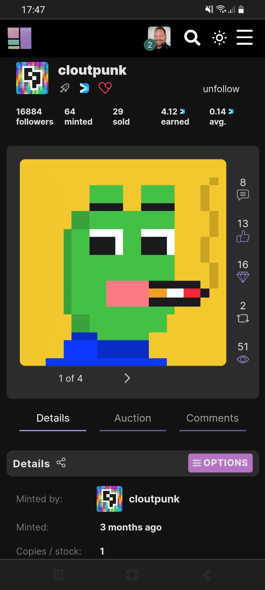
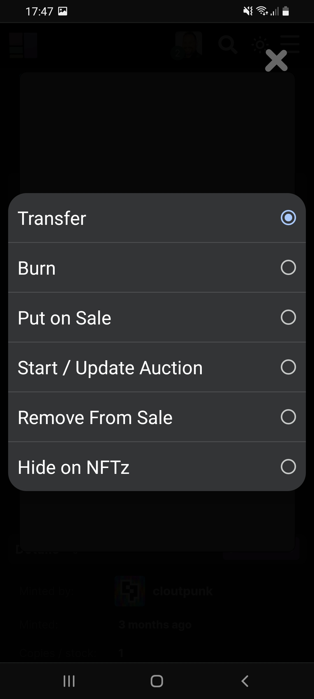
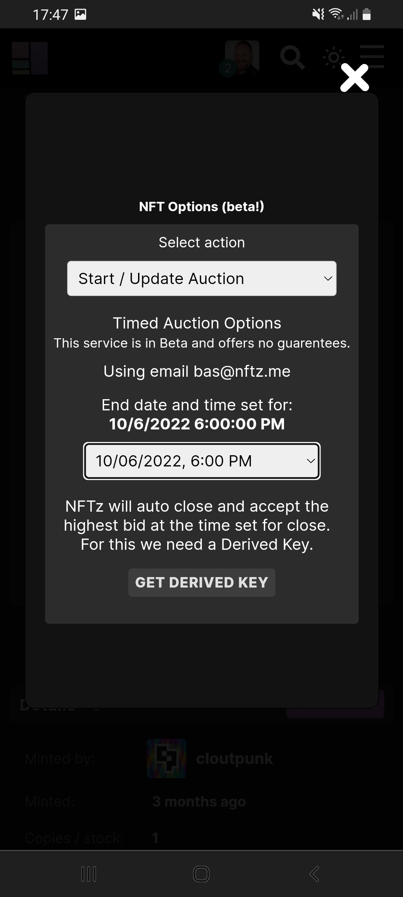
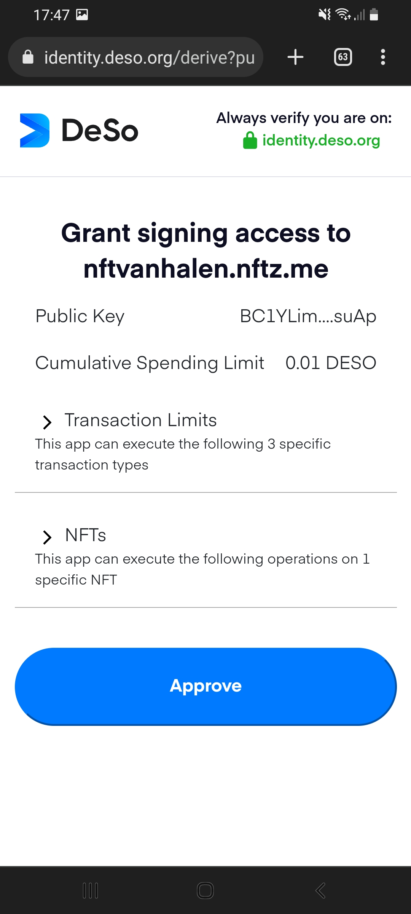
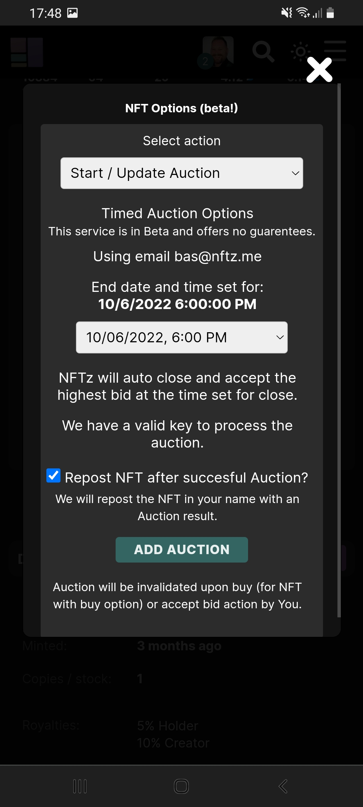

# How do you make a timed auction?

At NFTz it's possible to make a timed NFT auction. You can set the length of the auction and when the time is finished the following can happen:

a. The highest bidder wins when there are multiple bidders. If there is only 1 bidder, this person will win. If multiple bidders have the same highest bid amount then the first bidder will win.&#x20;

b. Somebody pays the full amount by using the buy function. This person will win the auction directly.

c. If there are no bidders the timed auction ends. The auction continues as an ordinary auction and it's possible to make bids. It's possible to start another timed auction. &#x20;

**Making a Timed auction**

1. Make sure you are logged in.
2. Mint the NFT if it hasn't been minted.
3. Go to the NFT and click on the  \~<mark style="color:purple;">Options</mark> button. If you have a mobile phone its behind the tab '**Details**'.&#x20;
4. Choose the option '**Start / update auction**'
5. Set an end date and time.
6. Press the button '**Get derived key**'
7. Choose '<mark style="color:blue;">Approve</mark>'
8. Toggle the option '**Repost NFT after succesful Auction**' if you want to alert who won the timed NFT auction.&#x20;
9. Press **Add auction**.&#x20;

You will receive a mail that a Timed Auction has started. You will also receive a mail if the Timed Auction has been won by a bidder.

If you have questions or something doesn't work you can go to our Telegram or Discord.

<figure><figcaption></figcaption></figure>

<figure><figcaption></figcaption></figure>

<figure><figcaption></figcaption></figure>

<figure><figcaption></figcaption></figure>

<figure><figcaption></figcaption></figure>

<figure><figcaption></figcaption></figure>
