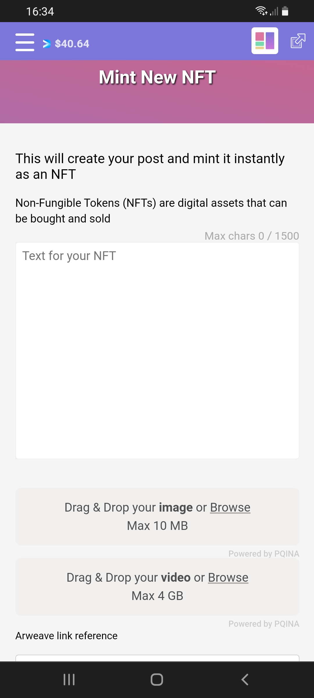

# How do you mint / sell an NFT?

1\. On the top-left of your screen, press the '=' button. (after log in) &#x20;

2\. Choose '**New NFT'**.

3\. Fill in your desired text at '**Text for your NFT'.** This can be anything you'd like, including the name/number of the NFT, a short description, etc.

4\. At the “**Drag & Drop your image or browse**” section, choose the JPG/PNG/GIF that you want to use for the NFT.

5\. Fill in your desired attributes (if applicable).&#x20;

_a. Amount of Copies (number of copies or editions you are minted of that one particular NFT)_      &#x20;

_b. Creator Royalty (the royalties you would like to receive upon the resales of your NFT)._        &#x20;

_c. Coin Holder Royalty (the royalties you would like your coin-holders to receive. Leave this at 0% if you are unsure)._   &#x20;

_d. Unlockable Content (any additional content you would like to provide to the buyer(s) of your NFT once it's purchased)._&#x20;

6\. Fill in '**Min Bid'**  the desired amount of Deso **or** fill in the desired amount of Deso at '**Buy Now'.** \[Only filling in Buy Now is easier if you don't know what to do]           &#x20;

7\. Press '**Mint Now'**

Congratulations you have just minted an NFT! :thumbsup:

**It doesnt work:**

If you keep getting errors you can go to our [troubleshoot](troubleshoot.md) or contact us at our [telegram](https://t.me/+qdNeX8CYB\_swZTQx) or [Discord](https://discord.gg/jQ34WMMZce).&#x20;

Extra Options (for experienced creators)

#### \[Extra 1: for experienced creators] Unlockable Content

To add unlockable content to your NFT, you can use the following steps:

1\.     Click '**Mint on NFT'**

2\.     Check **'Unlockable Content'**

3\.     Mint the NFT and put it on sale

The moment someone has put in a bid and you want to accept it you can add in the unlockable content.

**\[Extra 2: for experienced creators] Add extra / collection data**

To know more about this feature; go directly to [Traits by Extradata](broken-reference).&#x20;


Minting an NFT


