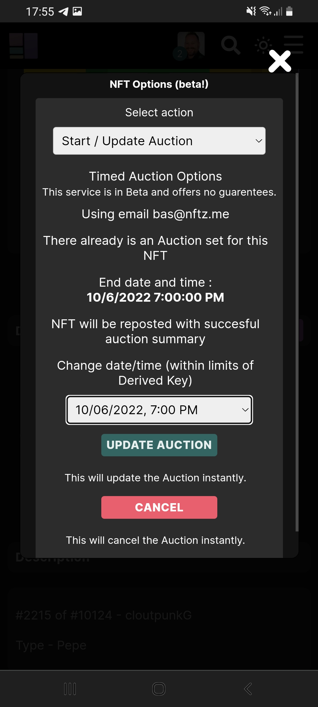

# How do you update a timed auction?

When a [timed auction](how-do-you-make-a-timed-auction.md) is going on and you want to change it, it's possible to change to end date or time. It's also possible to [cancel](how-do-you-cancel-a-timed-auction.md) the timed auction.&#x20;

**Update a timed auction**

1. Make sure you are logged in.
2. Go to the NFT and click on the  \~<mark style="color:purple;">Options</mark> button. If you have a mobile phone its behind the tab '**Details**'.&#x20;
3. Choose the option '**Start / update auction**'
4. Change the end date or time.&#x20;
5. Press the button '<mark style="color:green;">Update Auction</mark>'.

You will receive a mail that the auction has been updated.&#x20;

If you questions or are getting errors you can go to our [troubleshoot](../../troubleshoot/troubleshoot.md) or contact us at our [telegram](https://t.me/+qdNeX8CYB\_swZTQx) or [Discord](https://discord.gg/jQ34WMMZce).&#x20;

<figure><figcaption></figcaption></figure>

