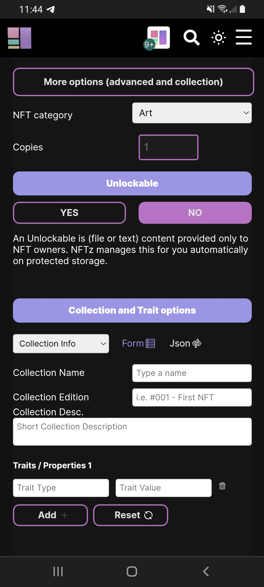

# How to add unlockable content? \[Advanced]

It's possible to add unlockable content to NFTs at NFTz. This feature is not for highly confidential files but rather high quality version(s) of an NFT, a message to NFT owners or a QR code.  It's also possible to add multiple files within the unlockable content when they are bundled in a zip file. Most file types are supported, but we recommend keeping the file size below 100MB. This feature also allows for the unlockable content to be accessed by a new owner once an NFL is sold or transferred.

## How to you add unlockable content?

1. &#x20;[Log in](../../users-guide/welcome/how-do-you-login-to-nftz.me.md) on your username.nftz.me&#x20;
2. Go to the top-right of your screen and click the '**=**' button and choose '**Mint**'. (If using a desktop computer you can also click **'Mint'** directly on the top of the screen.)
3. Expand the '**More options (advanced an collection)'** button.&#x20;
4. Click '**Yes**' under 'Unlockable'.&#x20;

5a. You can now input the text you'd like to send to the owner(s) of the NFT.&#x20;

5b. Then click on the square behind '**upload file?**' Next you can '**choose file**'.&#x20;

&#x20; 6\. Click **'**<mark style="color:green;">**Add Unlockable**</mark>'&#x20;

&#x20; 7\. [Mint](how-do-you-mint-sell-an-nft.md) the NFT.&#x20;

**​If this doesn't work:** Please goto our [troubleshoot](https://app.gitbook.com/o/hhkiTE1cLAJkwKs4XguV/s/1uei8FM8t4nPzvokagIX/troubleshoot/troubleshoot) page or contact us on our [telegram](https://t.me/+qdNeX8CYB\_swZTQx) or [Discord](https://discord.gg/jQ34WMMZce).

<figure><figcaption></figcaption></figure>
