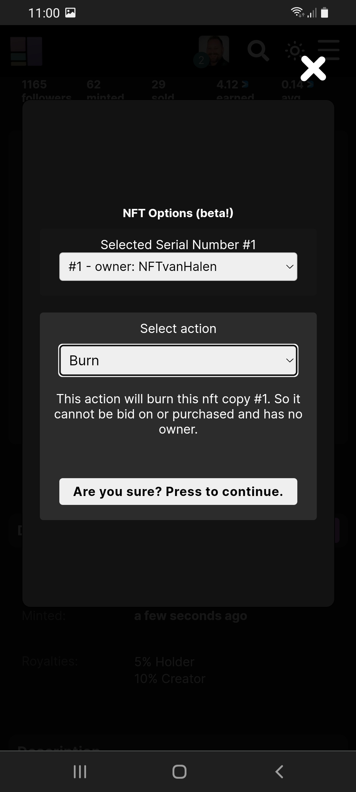

# How to burn an NFT?

You can burn a single copy of an NFT or burn all copies of an NFT. If the NFTs are for sale they will automatically be [removed from sale](how-to-close-an-nft-auction-remove-from-sale.md) before being burned. 

1\. Make sure you are logged in. 

2\. Make sure the corresponding NFT is removed from sale. ([How to close an NFT auction?](how-to-close-an-nft-auction-remove-from-sale.md))

3\. Click on the NFT you want to burn.

4\. Press the '<mark style="color:purple;">**\~Options**</mark>' button. (At a mobile you have to first press '**Details**')

5\. Choose the  '**Burn**' option.

6\. Select the '**selected Serial Number #1'** \[Only important if you own multiple NFT’s of the same]

7\. Click '**Are you Sure? Press to continue**'.

8\. Click **'Burn Serial # now**'   (If you have multiple serials you will also see '**Burn all Copies Now**'. If you want to burn all serials choose this option instead.)

**It doesnt work:**

If you keep getting errors you can go to our [troubleshoot](../../troubleshoot/troubleshoot.md) or contact us at our [telegram](https://t.me/+qdNeX8CYB\_swZTQx) or [Discord](https://discord.gg/jQ34WMMZce).



<figure><figcaption></figcaption></figure>
