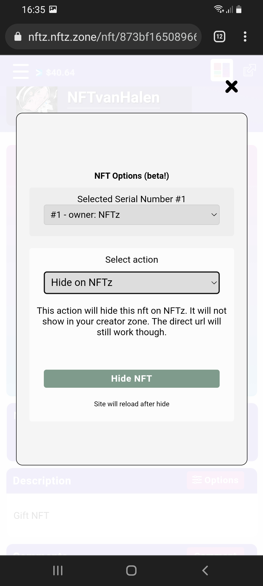

# How to hide an NFT?

Hiding an NFT is not the same as burning an NFT.  However, if you burn an NFT, the post will still remain, so you may also want to hide it.

1. Make sure you are logged In.
2. Click the corresponding NFT.&#x20;
3. Select the action '**Hide on NFTz**'
4. Click '**Hide NFT**'&#x20;



