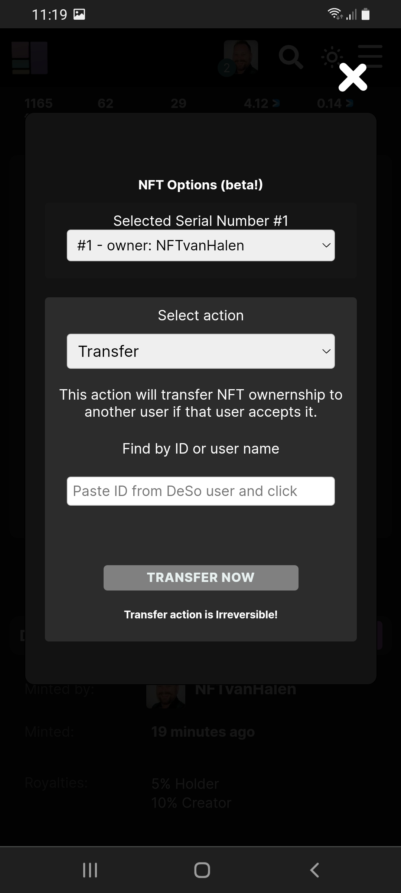

# How to Transfer an NFT?

1. Make sure you are logged in on your page.
2. Click on the NFT you want to transfer.
3. Press the '<mark style="color:purple;">**\~Options**</mark>' button. (At a mobile you have to first press '**Details**')
4. Select the '**selected Serial Number #1**' \[This is only important if you own multiple NFT’s of the same]
5. Choose the '**Transfer**' option \[It’s by default]
6. Find the user you want to transfer to.
7. Press '**Transfer Now**'.

**If you need to remove the NFT serial from sale first you can go to** [How to close an NFT action?](how-to-close-an-nft-auction.md)

**It doesnt work:**

If you keep getting errors you can go to our [troubleshoot](../../troubleshoot/troubleshoot.md) or contact us at our [telegram](https://t.me/+qdNeX8CYB\_swZTQx) or [Discord](https://discord.gg/jQ34WMMZce).&#x20;



<figure><figcaption></figcaption></figure>
